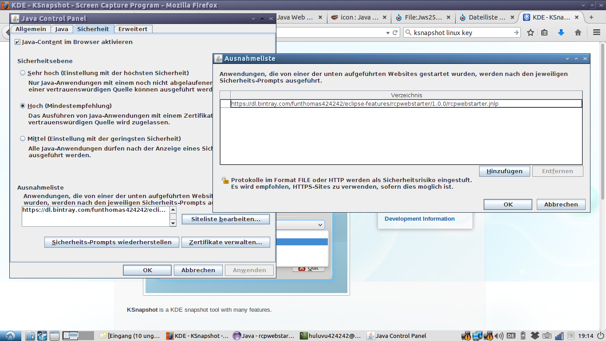

# rcpwebstarter Project
Ein Webstarter für RCP Anwendungen die irgendwo im Netz als zip File abliegen und keinen laufenden Servlet Container zum Download benötigen.

#Status

Letzter Shapshot:

#Usage
The webstarter is singned by a self zertificate because i have no payed for a valid zertificate of a office - i am only an common programmer. 

So you must add a security exception into your webstart config (start via jcontrol).

#Test 
To test the package you should click the link of [rcpwebstarter.jnlp](https://bintray.com/funthomas424242/eclipse-features/rcpwebstarter/_latestVersion/rcpwebstarter.jnlp)

